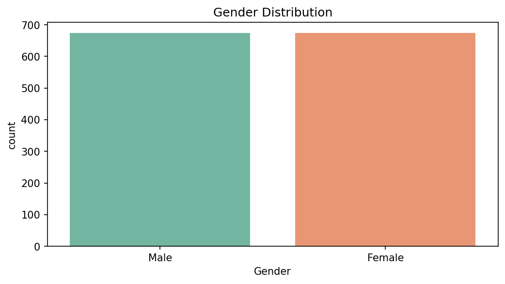
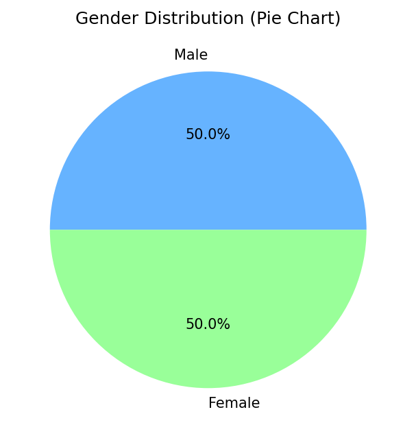
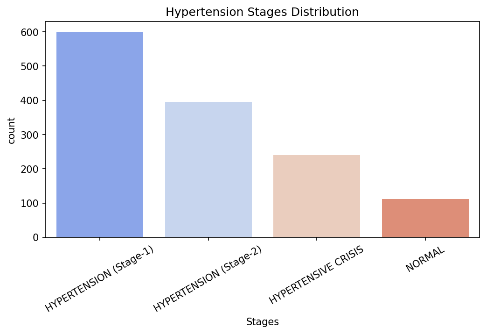
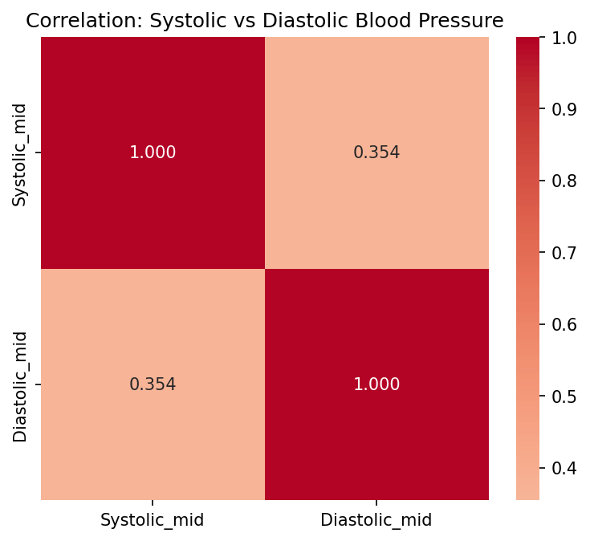
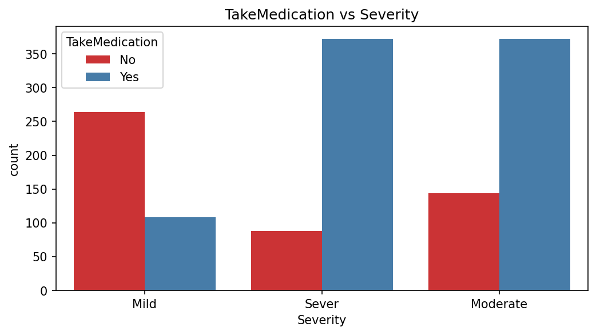
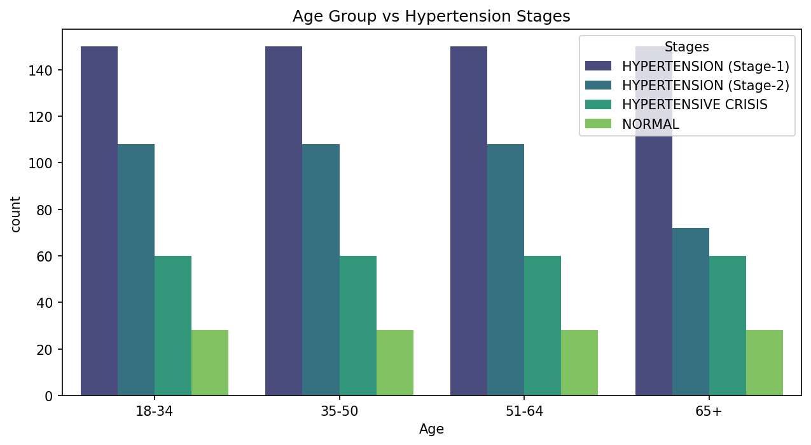
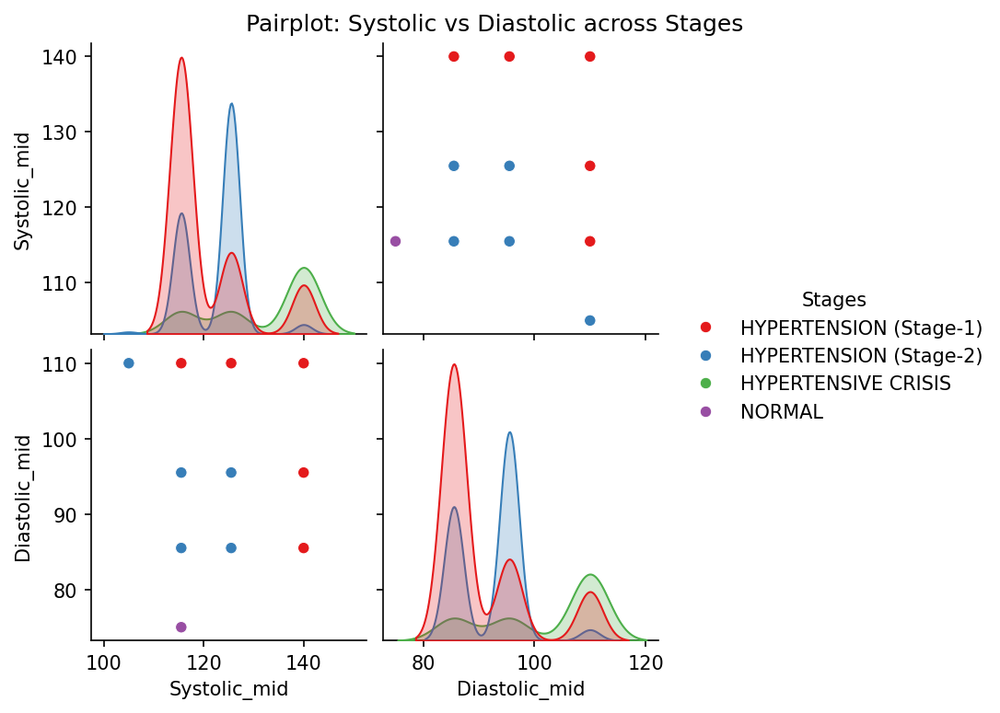

# HyperGuard AI — Hypertension Risk Assessment System

A clinical-grade, AI-powered web application that predicts hypertension stages using patient health parameters. Built with **Flask**, **Scikit-learn**, and a **premium medical UI**.


---

## Overview

This system uses a **Logistic Regression** model trained on 1,348 patient records to classify hypertension into 4 stages:

| Stage | Label | Risk Level |
|-------|-------|------------|
| 0 | Normal | Low Risk |
| 1 | Hypertension (Stage-1) | Moderate Risk |
| 2 | Hypertension (Stage-2) | High Risk |
| 3 | Hypertensive Crisis | EMERGENCY |

---

## Exploratory Data Analysis

### Gender Distribution
<p align="center">
  
  
</p>

### Hypertension Stages Distribution
<p align="center">
  
</p>

### Blood Pressure Correlation & Medication Analysis
<p align="center">
  
  
</p>

### Age Group vs Hypertension Stages
<p align="center">
  
</p>

### Pairplot: Systolic vs Diastolic by Stage
<p align="center">
  
</p>

---

## Project Structure

```
smart_bridge/
├── app.py                  # Flask backend (routes, prediction, recommendations)
├── data_preparation.py     # Data cleaning, encoding & scaling pipeline
├── eda.py                  # Exploratory Data Analysis (7 visualizations)
├── model_training.py       # Logistic Regression training & evaluation
├── patient_data.csv        # Raw dataset (1,825 records)
├── logreg_model.pkl        # Serialized trained model
├── scaler.pkl              # Serialized MinMaxScaler
├── requirements.txt        # Python dependencies
├── static/
│   └── style.css           # Medical-grade UI stylesheet
├── templates/
│   └── index.html          # Premium frontend template
└── eda_plots/              # Generated EDA visualizations
```

---

## Quick Start

### 1. Clone & Install

```bash
git clone https://github.com/Nl-T-lN/Predictive_pulse.git
cd Predictive_pulse
pip install -r requirements.txt
```

### 2. Run the Pipeline (optional — model is pre-trained)

```bash
python data_preparation.py   # Clean & encode data
python eda.py                # Generate EDA plots
python model_training.py     # Train model (saves logreg_model.pkl)
```

### 3. Launch the App

```bash
python app.py
```

Open [http://localhost:5000](http://localhost:5000) in your browser.

---

## Features

### Data Pipeline
- Column rename (`C` → `Gender`), inconsistency fixes, 477 duplicate removal
- Label encoding with exact clinical mappings
- MinMaxScaler on ordinal features (Age, Severity, Whendiagnoused, Systolic, Diastolic)

### Model
- **Logistic Regression** (chosen over Decision Tree/RF/SVM to avoid overfitting)
- Train/Test split: 80/20 with `random_state=42`
- Stratified evaluation across all 4 hypertension stages

### Web Application
- **13-field patient assessment form** organized in clinical sections
- **Color-coded risk results** with confidence percentage
- **Clinical recommendations** per stage (actions, priority level)
- **Animated confidence ring** and staged progress indicator
- **Responsive design** — works on desktop, tablet, and mobile

---

## Tech Stack

| Component | Technology |
|-----------|------------|
| Backend | Flask 3.x |
| ML Model | Scikit-learn (Logistic Regression) |
| Data Processing | Pandas, NumPy |
| Visualization | Matplotlib, Seaborn |
| Frontend | HTML5, CSS3, JavaScript |
| Typography | Inter (Google Fonts) |
| Serialization | Joblib |

---

## Disclaimer

> This tool is intended for **clinical decision support only**. It does not replace professional medical judgment. Always consult with qualified healthcare professionals for diagnosis and treatment decisions.

---

## License

This project is for educational and research purposes.
